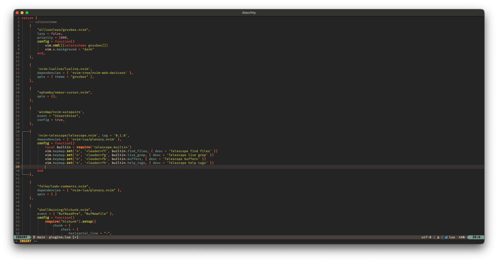

# Minivim



A super simple Neovim configuration with the absolute bare-minimum.
<br>
Great for people who prefer a clean "IDE" with no visual clutter (like me).

## Features

[included]

- A few themes
- Fuzzy finder (Space + FF, normal mode)
- Auto brackets and indentation
- Hlchunk plugin for extra eye-candy
- Fancy lualine :)
- LSP and autocompletions
- Easy configuration
<br><br>

[NOT included]

- Fancy file explorer
- Buffer line

## Installation

You should probably backup your old configuration:
```bash
mv ~/.config/nvim ~/.config/nvim_backup
```
Then clone this repo into your Neovim config directory (usually ~/.config/nvim):

```bash
git clone https://github.com/ferris-the-crab/Minivim.git ~/.config/nvim
```

You may also want to install a Nerd Font and Ripgrep for full functionallity.

## Configuration

Simple configuration can be done through the file ```~/.config/nvim/lua/config/config.lua```.
For language servers, simply add them to the list of language servers in your config.lua and make sure you have the LSP installed.
LSP naming can be a little different, such as "lua_ls" instead of "lua-language-server".
